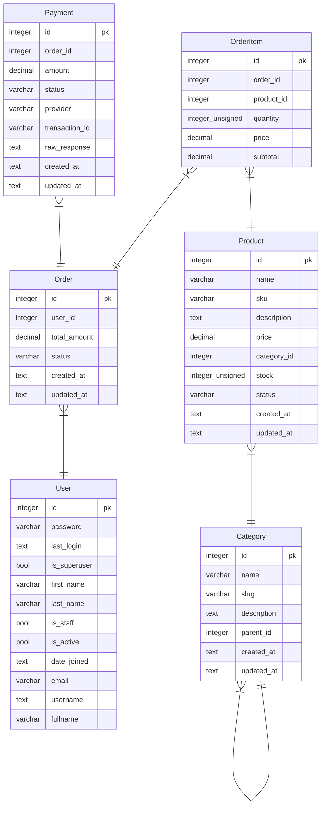

```mermaid

erDiagram
User {
  integer id pk
  varchar password 
  text last_login 
  bool is_superuser 
  varchar first_name 
  varchar last_name 
  bool is_staff 
  bool is_active 
  text date_joined 
  varchar email 
  text username 
  varchar fullname 
}
Category {
  integer id pk
  varchar name 
  varchar slug 
  text description 
  integer parent_id 
  text created_at 
  text updated_at 
}
Product {
  integer id pk
  varchar name 
  varchar sku 
  text description 
  decimal price 
  integer category_id 
  integer_unsigned stock 
  varchar status 
  text created_at 
  text updated_at 
}
Order {
  integer id pk
  integer user_id 
  decimal total_amount 
  varchar status 
  text created_at 
  text updated_at 
}
OrderItem {
  integer id pk
  integer order_id 
  integer product_id 
  integer_unsigned quantity 
  decimal price 
  decimal subtotal 
}
Payment {
  integer id pk
  integer order_id 
  decimal amount 
  varchar status 
  varchar provider 
  varchar transaction_id 
  text raw_response 
  text created_at 
  text updated_at 
}
Category }|--|| Category: ""
Order }|--|| User: ""
Payment }|--|| Order: ""
Product }|--|| Category: ""
OrderItem }|--|| Order: ""
OrderItem }|--|| Product: ""

```
