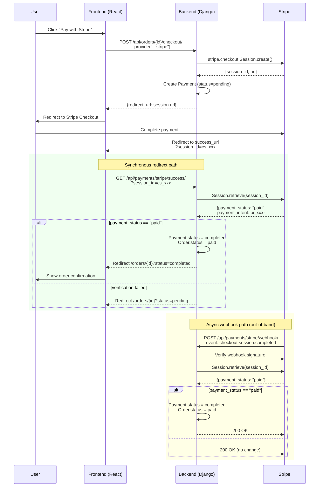
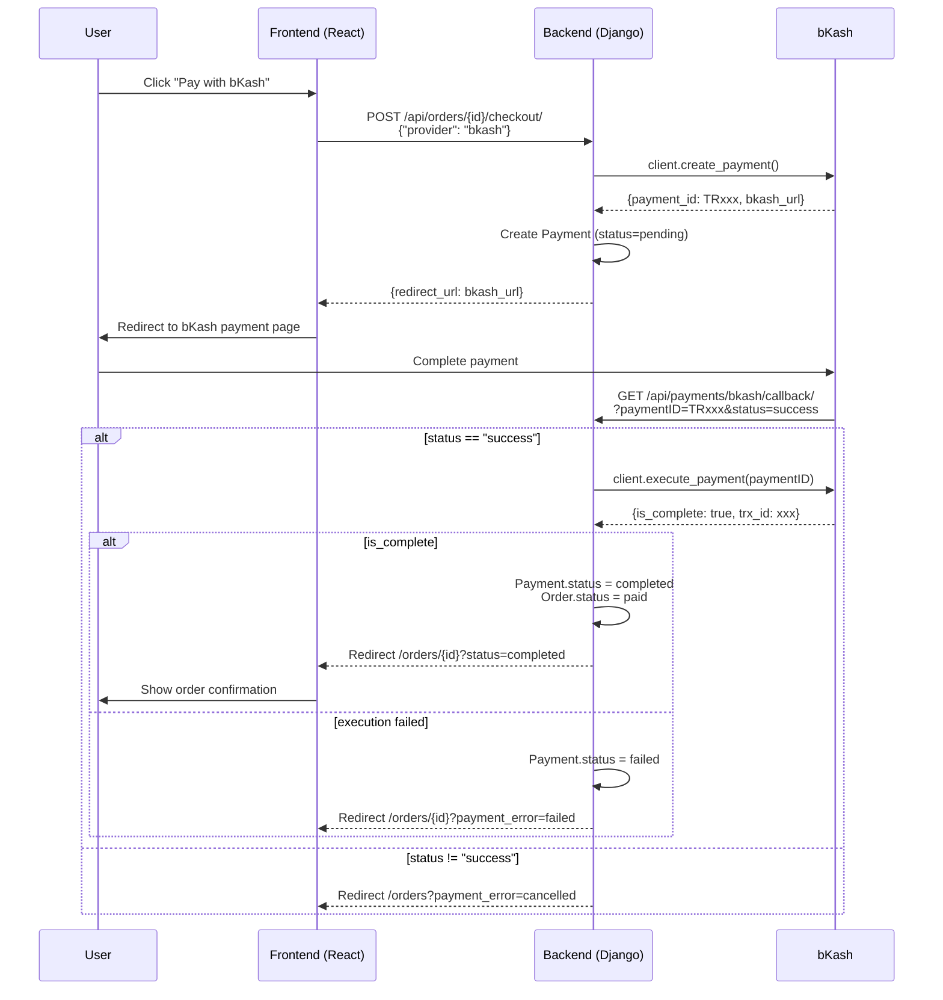

# Payment Flow Diagrams

## Stripe Payment Flow

```mermaid
sequenceDiagram
    participant User
    participant Frontend as Frontend (React)
    participant Backend as Backend (Django)
    participant Stripe

    User->>Frontend: Click "Pay with Stripe"
    Frontend->>Backend: POST /api/orders/{id}/checkout/<br/>{"provider": "stripe"}
    Backend->>Stripe: stripe.checkout.Session.create()
    Stripe-->>Backend: {session_id, url}
    Backend->>Backend: Create Payment (status=pending)
    Backend-->>Frontend: {redirect_url: session.url}
    Frontend->>User: Redirect to Stripe Checkout
    User->>Stripe: Complete payment
    Stripe->>Frontend: Redirect to success_url<br/>?session_id=cs_xxx

    rect rgb(240, 255, 240)
        Note over Frontend,Backend: Synchronous redirect path
        Frontend->>Backend: GET /api/payments/stripe/success/<br/>?session_id=cs_xxx
        Backend->>Stripe: Session.retrieve(session_id)
        Stripe-->>Backend: {payment_status: "paid",<br/>payment_intent: pi_xxx}
        alt payment_status == "paid"
            Backend->>Backend: Payment.status = completed<br/>Order.status = paid
            Backend-->>Frontend: Redirect /orders/{id}?status=completed
            Frontend->>User: Show order confirmation
        else verification failed
            Backend-->>Frontend: Redirect /orders/{id}?status=pending
        end
    end

    rect rgb(255, 255, 230)
        Note over Backend,Stripe: Async webhook path (out-of-band)
        Stripe->>Backend: POST /api/payments/stripe/webhook/<br/>event: checkout.session.completed
        Backend->>Stripe: Verify webhook signature
        Backend->>Stripe: Session.retrieve(session_id)
        Stripe-->>Backend: {payment_status: "paid"}
        alt payment_status == "paid"
            Backend->>Backend: Payment.status = completed<br/>Order.status = paid
            Backend-->>Stripe: 200 OK
        else
            Backend-->>Stripe: 200 OK (no change)
        end
    end
```

## bKash Payment Flow

```mermaid
sequenceDiagram
    participant User
    participant Frontend as Frontend (React)
    participant Backend as Backend (Django)
    participant bKash

    User->>Frontend: Click "Pay with bKash"
    Frontend->>Backend: POST /api/orders/{id}/checkout/<br/>{"provider": "bkash"}
    Backend->>bKash: client.create_payment()
    bKash-->>Backend: {payment_id: TRxxx, bkash_url}
    Backend->>Backend: Create Payment (status=pending)
    Backend-->>Frontend: {redirect_url: bkash_url}
    Frontend->>User: Redirect to bKash payment page
    User->>bKash: Complete payment
    bKash->>Backend: GET /api/payments/bkash/callback/<br/>?paymentID=TRxxx&status=success

    alt status == "success"
        Backend->>bKash: client.execute_payment(paymentID)
        bKash-->>Backend: {is_complete: true, trx_id: xxx}
        alt is_complete
            Backend->>Backend: Payment.status = completed<br/>Order.status = paid
            Backend-->>Frontend: Redirect /orders/{id}?status=completed
            Frontend->>User: Show order confirmation
        else execution failed
            Backend->>Backend: Payment.status = failed
            Backend-->>Frontend: Redirect /orders/{id}?payment_error=failed
        end
    else status != "success"
        Backend-->>Frontend: Redirect /orders?payment_error=cancelled
    end
```
